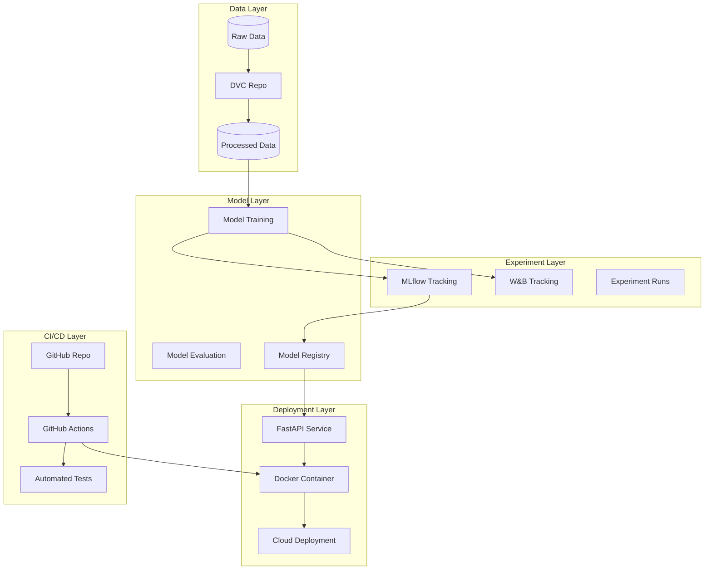

# Crime Prediction MLOps Pipeline

## Project Overview

Build an industry-grade MLOps pipeline to predict violent crimes per population using the Communities and Crime dataset (1994 instances, 122 predictive features). The pipeline will cover data preprocessing, feature engineering, model training, evaluation, and deployment with full observability.

## Architecture Overview



## Project Structure

```
crime-prediction/
├── data/
│   ├── raw/                    # Original data (gitignored)
│   ├── processed/              # Processed data (DVC tracked)
│   └── external/               # External data sources
├── src/
│   ├── data/                   # Data processing scripts
│   │   ├── __init__.py
│   │   ├── load_data.py        # Data loading utilities
│   │   ├── preprocess.py       # Preprocessing pipeline
│   │   └── feature_engineering.py
│   ├── models/                 # Model code
│   │   ├── __init__.py
│   │   ├── train.py            # Training script
│   │   ├── predict.py          # Prediction utilities
│   │   └── evaluate.py         # Evaluation metrics
│   ├── features/               # Feature definitions
│   │   └── feature_store.py
│   └── api/                    # API code
│       ├── __init__.py
│       ├── main.py             # FastAPI application
│       ├── schemas.py          # Pydantic schemas
│       └── models.py           # Model loading
├── tests/                      # Test suite
│   ├── unit/
│   ├── integration/
│   └── e2e/
├── notebooks/                  # Jupyter notebooks for EDA
│   └── exploration.ipynb
├── scripts/                    # Utility scripts
│   ├── setup_dvc.sh
│   └── setup_mlflow.sh
├── .github/
│   └── workflows/
│       ├── train.yml           # Training pipeline
│       ├── test.yml            # Testing pipeline
│       └── deploy.yml          # Deployment pipeline
├── docker/
│   ├── Dockerfile              # Model serving container
│   └── docker-compose.yml      # Local development
├── config/
│   ├── config.yaml             # Configuration file
│   └── experiment_config.yaml  # Experiment parameters
├── requirements.txt            # Python dependencies
├── setup.py                    # Package setup
├── .dvc/                       # DVC configuration
├── .mlflow/                    # MLflow local backend (optional)
├── README.md
└── .gitignore
```

## Implementation Plan

### Phase 1: Project Setup & Data Versioning

**Files to create:**

- `requirements.txt` - Python dependencies
- `setup.py` - Package configuration
- `.gitignore` - Git ignore patterns
- `config/config.yaml` - Project configuration
- `.dvc/.gitignore` and `.dvc/config` - DVC setup

**Tasks:**

1. Initialize project structure with proper Python packaging
2. Set up DVC for data versioning

   - Initialize DVC repository
   - Configure remote storage (local for now, cloud storage for production)
   - Add raw data to DVC tracking

3. Create configuration management using YAML files
4. Set up dependency management with requirements.txt

### Phase 2: Data Preprocessing Pipeline

**Files to create:**

- `src/data/load_data.py` - Load and parse Communities dataset
- `src/data/preprocess.py` - Data cleaning and preprocessing
- `src/data/feature_engineering.py` - Feature creation and selection
- `notebooks/exploration.ipynb` - EDA notebook

**Tasks:**

1. Data loading and parsing

   - Parse `communities.names` for column definitions
   - Load `communities.data` with proper handling of missing values (`?`)
   - Identify non-predictive columns (state, county, community, communityname, fold)

2. Data cleaning

   - Handle missing values (many columns have 1675 missing values from LEMAS data)
   - Strategies: imputation, feature dropping, indicator variables
   - Handle outliers (data already normalized 0-1, but check for anomalies)

3. Feature engineering

   - Create feature groups: socio-economic, demographic, law enforcement
   - Feature selection using correlation analysis and domain knowledge
   - Create interaction features if beneficial
   - Store processed data with DVC

4. Data validation

   - Implement data quality checks (Great Expectations or custom validators)
   - Schema validation
   - Train/test split with stratification considerations

### Phase 3: Experiment Tracking Setup

**Files to create:**

- `scripts/setup_mlflow.sh` - MLflow initialization script
- `src/models/train.py` - Training script with MLflow integration
- `config/experiment_config.yaml` - Experiment parameters

**Tasks:**

1. Set up MLflow

   - Configure MLflow tracking URI (local or remote)
   - Define experiment structure
   - Implement logging for:
     - Parameters (model hyperparameters, preprocessing choices)
     - Metrics (RMSE, MAE, R², custom metrics)
     - Artifacts (preprocessing pipeline, feature importance, plots)
     - Model artifacts (trained models)

2. Set up Weights & Biases (optional, for comparison)

   - Initialize W&B project
   - Integrate with training pipeline
   - Log experiments for comparison

3. Implement experiment management

   - Version control for experiments
   - Experiment comparison utilities
   - Model registry integration

### Phase 4: Model Development

**Files to create:**

- `src/models/train.py` - Main training script
- `src/models/evaluate.py` - Evaluation metrics and validation
- `src/features/feature_store.py` - Feature definitions

**Tasks:**

1. Baseline model

   - Implement simple baseline (mean, median, linear regression)
   - Establish performance benchmarks

2. Model experimentation

   - Try multiple algorithms:
     - Linear Regression (Ridge, Lasso, ElasticNet)
     - Tree-based models (Random Forest, XGBoost, LightGBM)
     - Neural Networks (if data size permits)
   - Hyperparameter tuning (Optuna, Hyperopt, or GridSearch)
   - Cross-validation strategy

3. Model evaluation

   - Implement comprehensive metrics:
     - Regression metrics: RMSE, MAE, R², MAPE
     - Residual analysis
     - Feature importance analysis
   - Model validation with cross-validation
   - Save evaluation artifacts (plots, reports)

4. Model selection

   - Compare models using MLflow
   - Select best model based on validation performance
   - Register model in MLflow Model Registry

### Phase 5: Model Registry & Versioning

**Tasks:**

1. MLflow Model Registry

   - Register best model
   - Version models
   - Model stage management (Staging, Production)
   - Model metadata and tags

2. Model artifacts

   - Save preprocessing pipeline (sklearn Pipeline)
   - Save feature transformers
   - Save model with dependencies
   - Create model card with performance metrics

### Phase 6: API Development

**Files to create:**

- `src/api/main.py` - FastAPI application
- `src/api/schemas.py` - Request/response schemas
- `src/api/models.py` - Model loading and prediction
- `tests/integration/test_api.py` - API tests

**Tasks:**

1. FastAPI service

   - Create REST API endpoints:
     - `/health` - Health check
     - `/predict` - Single prediction
     - `/predict/batch` - Batch predictions
     - `/model/info` - Model metadata
   - Input validation with Pydantic schemas
   - Error handling and logging

2. Model serving

   - Load model from MLflow registry
   - Implement prediction pipeline (preprocess → predict → postprocess)
   - Add prediction logging

3. API documentation

   - Auto-generated OpenAPI/Swagger docs
   - Example requests/responses
   - API usage guidelines

### Phase 7: Containerization

**Files to create:**

- `docker/Dockerfile` - Production container
- `docker/docker-compose.yml` - Local development setup
- `.dockerignore` - Docker ignore patterns

**Tasks:**

1. Docker container

   - Multi-stage Dockerfile for optimization
   - Install dependencies
   - Copy model artifacts
   - Set up FastAPI service
   - Configure health checks

2. Docker Compose (for local testing)

   - Service configuration
   - Volume mounts for data
   - Environment variables

3. Container testing

   - Build and test container locally
   - Verify model loading
   - Test API endpoints

### Phase 8: CI/CD Pipeline

**Files to create:**

- `.github/workflows/train.yml` - Training pipeline
- `.github/workflows/test.yml` - Testing pipeline
- `.github/workflows/deploy.yml` - Deployment pipeline

**Tasks:**

1. Testing pipeline

   - Unit tests (pytest)
   - Integration tests
   - Code quality checks (black, flake8, pylint)
   - Data validation tests

2. Training pipeline

   - Trigger on data changes or schedule
   - Run training experiments
   - Register models automatically
   - Generate reports

3. Deployment pipeline

   - Build Docker image
   - Push to container registry
   - Deploy to cloud platform
   - Run smoke tests
   - Health checks

### Phase 9: Cloud Deployment

**Tasks:**

1. Cloud platform selection and setup

   - Options: AWS (SageMaker/EC2/ECS), GCP (AI Platform/Cloud Run), Azure (ML Service)
   - Set up infrastructure (IaC with Terraform or cloud console)
   - Configure cloud storage for DVC and MLflow artifacts

2. Deployment options

   - **Option A: Serverless** (AWS Lambda, Google Cloud Functions)
   - **Option B: Container Service** (AWS ECS/Fargate, Google Cloud Run, Azure Container Instances)
   - **Option C: Kubernetes** (AWS EKS, GKE, AKS)
   - **Option D: Managed ML Service** (AWS SageMaker, GCP AI Platform, Azure ML)

3. Model serving

   - Deploy FastAPI service
   - Set up load balancing
   - Configure auto-scaling
   - Set up monitoring and alerting

### Phase 10: Monitoring & Observability

**Tasks:**

1. Model monitoring

   - Log predictions and actuals (if available)
   - Track prediction latency
   - Monitor model drift
   - Data quality monitoring

2. API monitoring

   - Request/response logging
   - Error tracking
   - Performance metrics (latency, throughput)
   - Health check endpoints

3. Alerts and dashboards

   - Set up alerts for anomalies
   - Create dashboards (MLflow UI, cloud monitoring)
   - Regular performance reports

## Key Technologies & Tools

- **Data Versioning**: DVC (Data Version Control)
- **Experiment Tracking**: MLflow, Weights & Biases
- **Model Registry**: MLflow Model Registry
- **API Framework**: FastAPI
- **Containerization**: Docker
- **CI/CD**: GitHub Actions
- **Cloud Platforms**: AWS/GCP/Azure (based on preference)
- **Monitoring**: MLflow, CloudWatch/Stackdriver/Application Insights
- **Testing**: pytest, pytest-cov
- **Code Quality**: black, flake8, mypy

## Deliverables

1. Complete MLOps pipeline with all phases implemented
2. Trained and registered model in MLflow
3. Docker containerized API service
4. CI/CD pipelines for automated training and deployment
5. Cloud-deployed model serving endpoint
6. Monitoring and observability setup
7. Comprehensive documentation (README, API docs, architecture docs)
8. Test suite with good coverage

## Next Steps

1. Start with Phase 1-2: Set up project structure and data preprocessing
2. Implement Phase 3-4: Experiment tracking and model development
3. Move to Phase 5-7: Model registry, API, and containerization
4. Complete Phase 8-10: CI/CD, deployment, and monitoring